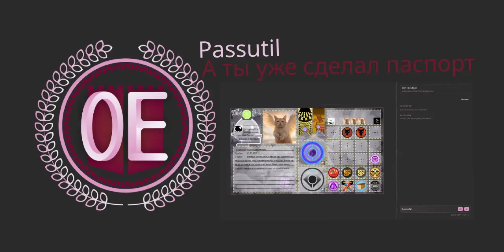

# Passutil — генератор паспорта для Obsidian Empire

Инструмент для сервера **Obsidian Empire**, который позволяет создать **паспорт** имперца.


<div align="center">
  
</div>

## Что это делает

- собирает данные/элементы для паспорта
- отрисовывает визуальный паспорт
- позволяет экспортировать результат в webp

## Стек

- Preact
- Vite
- TypeScript

## Быстрый старт

```bash
npm install
npm run dev
```

Сборка:

```bash
npm run build
```

## Лицензия

 [**LICENSE_QQRM_LAPOCHKA**](LICENSE_QQRM_LAPOCHKA).
